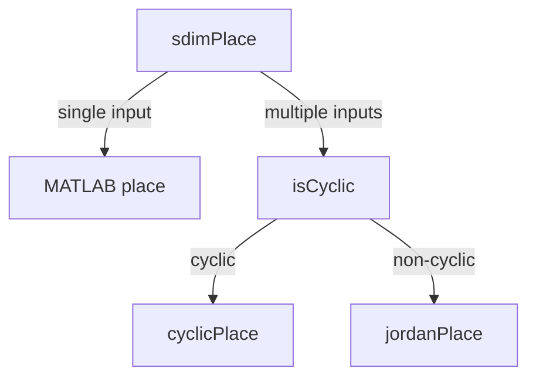

# Multi-variable Control Project2

[TOC]

## Requirement

> Requirement:
> Modify MATLAB command "place" so to make user have more flexibility in choosing pole-placement controller K when it is not unique.

## Introduction

This project is used to calculate controller gain K for a given system (A,B) and desired poles. If K is not unique, users can adjust seed value to choose different K. The function "sdimPlace.m" is the main entry of this project. 

- File Structure
    - "sdimPlace.m": main entry of the project.
    - "isCyclic.m": judge if the matrix is cyclic.
    - "mustBeControllable.m": check if the pair (A,B) is controllable.
    - "cyclicPlace.m": place poles for cyclic matrix.
    - "jordanPlace.m": place poles for non-cyclic matrix.
    - "examples.mlx": example file concerning the three usages of "sdimPlace.m".

- Environment
    - MATLAB R2023a
    - This project uses "arguments" instead of "varargin" for default parameters, MATLAB version before R2019b is not supported.

## Usage

### Applications

Function `sdimPalce()` has three usages:
- Single input case, directly use MATLAB "place" function.
- Multiple inputs and cyclic case.
- Multiple inputs and non-cyclic case.

Examples can be found in "examples.mlx".

### Parameters
    - A: state matrix
    - B: input matrix
    - poles: desired poles
    - seed: seed for random number generator (optional)

pair(A,B) must be controllable. If not, do **controllability decomposition** first. Then use the function `sdimPlace(A,B,poles,seed)` to get the controller K for controllable subsystems.

### Output
    - K: controller matrix or matrices

Use `sdimPlace(A,B,poles,seed)` to get the controller K. Change the `seed`` to get different results if K is not unique.

## Algorithm
flowchart of the `sdimPlace()` function


### SISO
For single input case, the function `place()` in MATLAB is used directly. Of course, Ackermann's formula and Bass-Gura formula can also be used to get the controller K. They are simple in the single input case.

### MI & Cyclic
> Theorem (Controllability with p inputs and controllability with 1 input). If the n-dimensional p-input pair (A, B) is controllable and if A is cyclic, then for almost any p × 1 vector V, the single-input pair (A, BV) is controllable.

First judge if the matrix is cyclic (characteristic polynomial = minimal polynomial). If it is cyclic, then use the above theorem to get the controller K.

Random number generator is used to generate the vector V. We need to ensure that the pair (A, BV) is controllable. Therefore if the pair (A, B) is not controllable, V will be generated again until the pair (A, BV) is controllable. Then use MATLAB function `place()` or Bass-Gura formula to get the controller K_init for the pair(A, BV). Finally, 
$K = V  K_{init}$


### MI & Non-cyclic
MATLAB function `place()` has an limitation that it cannot place poles with multiplicity greater than rank(B). It will display the error message: The `"place" command cannot place poles with multiplicity greater than rank(B)`.

So I use the Jordan form of A to solve this problem. Repeated eigenvalues of A are treated as jordan blocks rather than single eigenvalues. To be specific, I split the repeated eigenvalues into two groups (of cource they can be splitted into more groups) and calculate the controller K for each group. It is worth noting that the number of jordan blocks of repeated eigenvalues still cannot be greater than rank(B). 

If we do eigen decomposition of A - BK, we can get the following equation:

$A - B\,K = V\,\Lambda\,V^{-1}$

with $A, \Lambda, V \in R^{n \times n}, B \in R^{n \times p}, K \in R^{p \times n}$, where $\Lambda$ is a diagonal matrix with eigenvalues of A - BK on the diagonal.

Then the largest number of columns of V (eigenvectors) that can be chosen freely should equal:

$number \le \displaystyle\frac{n(p-1)}{n-1}$


Let $\Omega = KV$ which is chosen randomly.

For each jordan block of repeated eigenvalues, the corresponding columns of $V$ can be calculated by the following equation:

$V_{\bullet,i} = (A - \Lambda_{i,i}\,I)^{-1} B\,\Omega_{\bullet,i}$

$V_{\bullet,i+k} = (A - \Lambda_{i,i}\,I)^{-1} (B\,\Omega_{\bullet,i+k} + V_{\bullet,i+k-1})$

After calculating each columns of $V$, we can get the controller K by the following equation: 

$K = \Omega V^{-1}$

Since the combination of repeated eigenvalues is not unique, we need to calculate the controller K for each combination.

## Future Plan

Some optimization method can be used to make the controller gain matrix K better.

## References

[1] K. van der Veen, “Reference Request: Algorithm for Eigenvalues Placement for MIMO LTI Dynamical Systems,” *Mathematics Stack Exchange*, Aug. 06, 2017. https://math.stackexchange.com/questions/2388491/reference-request-algorithm-for-eigenvalues-placement-for-mimo-lti-dynamical-sy (accessed Jan. 18, 2024).

[2] J. Braslavsky, “Control Systems Design Lecture 20: Scaling and MIMO State Feedback Design.” Accessed: Jan. 18, 2024. [Online]. Available: https://www.eng.newcastle.edu.au/~jhb519/teaching/elec4410/lectures/Lec20.pdf

## Examples

```matlab
% Single input case, directly use MATLAB "place" function.
A1 = [2 1 0; 0 2 1; 0 0 2];
B1 = [1; 2; 3];
eig(A1)
poles1 = [-1 -3 -4];
K1 = sdimPlace(A1,B1,poles1)
eig(A1 - B1 * K1)

% Multiple inputs and cyclic case
A2 = [0 1 1; -6 -8 2; 0 0 3];
B2 = [0 1; 1 0; 0 1];
poles2 = [-4 -5 -6];

eig(A2)

K2_1 = sdimPlace(A2,B2,poles2,1)
K2_2 = sdimPlace(A2,B2,poles2,2)
K2_3 = sdimPlace(A2,B2,poles2,3)

eig(A2 - B2 * K2_1)
eig(A2 - B2 * K2_2)
eig(A2 - B2 * K2_3)

% Multiple inputs and non-cyclic case
A3 = [0 1 0 0;
    0 0 0 0;
    0 0 0 1;
    0 0 0 0];

B3 = [0 0; 1 0; 0 0; 0 1];

poles3 = [-1 -1 -1 -1];

% MATLAB place function cannot solve this placement 
% It will display: The "place" command cannot place poles with multiplicity
% greater than rank(B)
K3 = sdimPlace(A3,B3,poles3,2)

K3_3 = K3(:,:,3);
eig(A3 - B3 * K3_3)

```

